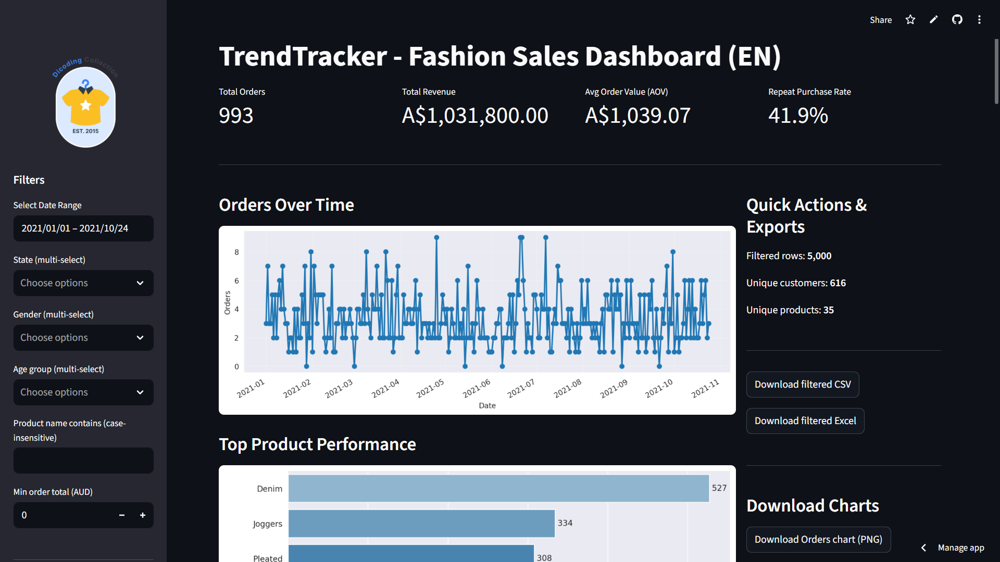
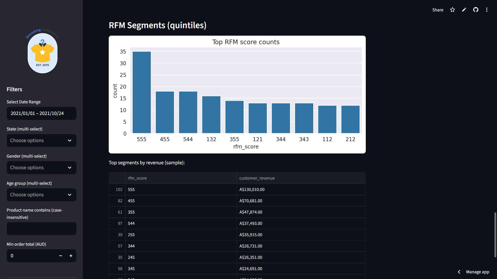
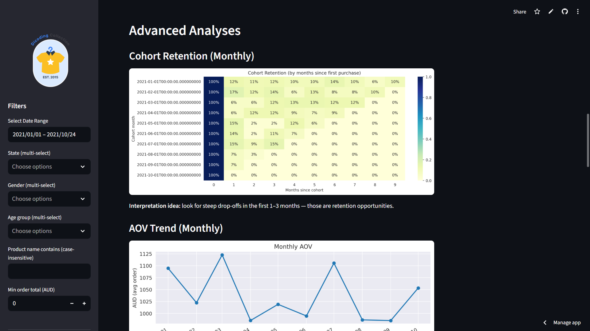

# 👗 TrendTracker – Fashion Sales & Customer Behavior Dashboard

**TrendTracker** is an end-to-end data analytics project that helps fashion retailers understand customer behavior, monitor product performance, and track sales trends using a clean, interactive dashboard and Python-based data pipeline.

---

## 1. Business Problem

Fashion retailers often struggle with:
- Identifying which products, categories, and collections are underperforming
- Understanding customer demographics, repeat behavior, and retention gaps
- Tracking monthly sales, revenue trends, and campaign effectiveness
- No segmentation framework to prioritize high-value customers  
- Lack of a centralized, interactive dashboard for stakeholders  


**TrendTracker** solves these challenges by combining cleaned sales and customer data with visual analytics to enable business decision-making across product, marketing, and merchandising teams.

---

## 2. Project Objectives

- Build a **clean, reliable dataset** from raw sales, product & customer files
- Perform **exploratory data analysis (EDA)** to identify trends & patterns
- Create **RFM-based customer segmentation** for retention and marketing campaigns
- Build a streamlined **Streamlit dashboard** with KPIs, filters, and charts
- Generate **business insights** for product, marketing, and growth teams

---

## 3. Tech Stack

| Layer             | Tools Used                       |
|------------------|----------------------------------|
| **Data Cleaning** | Python (Pandas, NumPy)    |
| **Exploratory Analysis** | Pandas, Matplotlib, Seaborn |
| **Segmentation**  | RFM (Recency, Frequency, Monetary) modeling |
| **Dashboarding**  | Streamlit, Plotly                |
| **Documentation** | Jupyter Notebook, Markdown |

---

## 4. Data Pipeline Flow

```text
                 ┌──────────────────────────┐
                 │        Raw Data           │
                 │  (customers, orders,      │
                 │   products CSV files)     │
                 └─────────────┬────────────┘
                               │
                               ▼
                    ┌───────────────────┐
                    │  Data Cleaning &  │
                    │    Preprocessing  │
                    │ (Pandas, NumPy)   │
                    └─────────┬─────────┘
                              │
                              ▼
                  ┌──────────────────────┐
                  │ Exploratory Analysis │
                  │ (Plots, Trends, EDA) │
                  └────────────┬─────────┘
                               │
                               ▼
                  ┌──────────────────────┐
                  │   RFM Segmentation   │
                  │  (Recency, Frequency,│
                  │      Monetary)       │
                  └────────────┬─────────┘
                               │
                               ▼
                  ┌──────────────────────┐
                  │   Streamlit App      │
                  │  KPIs, Filters, UI   │
                  └────────────┬─────────┘
                               │
                               ▼
                 ┌──────────────────────────┐
                 │ Interactive Dashboard     │
                 │  (Insights & Decisions)   │
                 └──────────────────────────┘
```

## 5. Project Architecture

```text
trendtracker-fashion-sales/
├── dashboard/               # Streamlit dashboard application
│   ├── dashboard.py        # Main application file
│   └── all_data.csv        # Preprocessed dataset
├── dataset/                # Raw data files
│   ├── customers.csv       # Customer information
│   ├── orders.csv         # Order details
│   ├── products.csv       # Product catalog
│   ├── sales.csv          # Sales transactions
│   └── Legend.txt         # Data dictionary
├── docs/                   # Documentation and screenshots
│   └── screenshots/       # Dashboard screenshots
│       ├── dashboard_overview.png
│       ├── rfm_analysis.png
│       └── cohort_analysis.png
├── assets/                # Static resources
│   └── logo.png          # Application logo
├── Online_Fashion_Data_Analysis.ipynb  # Jupyter notebook for EDA
├── online_fashion_data_analysis.py     # Script version of the analysis
├── requirements.txt       # Python dependencies
└── README.md             # Project documentation
```

## 6. Data Dictionary

### Customers (`dataset/customers.csv`)
| Column | Type | Description |
|--------|------|-------------|
| customer_id | String | Unique identifier for each customer |
| customer_name | String | Full name of the customer |
| gender | String | Customer's gender (M/F/Other) |
| age | Integer | Customer's age |
| home_address | String | Complete address |
| zip_code | String | Postal/ZIP code |
| city | String | City of residence |
| state | String | State/Province |
| country | String | Country of residence |

### Orders (`dataset/orders.csv`)
| Column | Type | Description |
|--------|------|-------------|
| order_id | String | Unique order identifier |
| customer_id | String | Reference to customer |
| order_date | Date | Date of order placement |
| delivery_date | Date | Date of order delivery |

### Products (`dataset/products.csv`)
| Column | Type | Description |
|--------|------|-------------|
| product_id | String | Unique product identifier |
| product_type | String | Main category of product |
| product_name | String | Name of the product |
| size | String | Available sizes (S/M/L/XL) |
| color | String | Product color |
| price | Float | Unit price in AUD |
| quantity | Integer | Available stock quantity |
| description | String | Product description |

### Sales (`dataset/sales.csv`)
| Column | Type | Description |
|--------|------|-------------|
| sales_id | String | Unique sales record identifier |
| order_id | String | Reference to order |
| product_id | String | Reference to product |
| price_per_unit | Float | Price per unit at time of sale |
| quantity | Integer | Number of units sold |
| total_price | Float | Total transaction amount (price_per_unit * quantity) |

### Main Dataset (`dashboard/all_data.csv`)
| Column | Type | Description |
|--------|------|-------------|
| order_id | String | Unique order identifier |
| order_date | DateTime | When the order was placed |
| customer_id | String | Unique customer identifier |
| customer_name | String | Name of the customer |
| product_id | String | Unique product identifier |
| product_name | String | Name of the product |
| category | String | Product category (e.g., Clothing, Accessories) |
| sub_category | String | Product sub-category (e.g., Tops, Dresses) |
| price | Float | Unit price of the product |
| quantity | Integer | Number of units ordered |
| total_price | Float | Total price (price × quantity) |
| delivery_date | DateTime | When the order was delivered |
| gender | String | Customer's gender (M/F/Other) |
| age | Integer | Customer's age |
| state | String | Customer's state of residence |
| payment_method | String | Payment method used (Credit Card, UPI, etc.) |

### RFM Analysis
| Metric | Description |
|--------|-------------|
| recency | Days since last purchase |
| frequency | Total number of transactions |
| monetary | Total amount spent |
| rfm_score | Combined RFM score (1-5, where 5 is best) |


## 7. Feature Highlights

### Data Analysis
- **Sales & Revenue Trends** with monthly AOV (Average Order Value) tracking
- **Customer Demographics** analysis by age group, gender, and state
- **Product Performance** tracking with top-selling items and categories
- **Cohort Analysis** to understand customer retention patterns

### 🔍 Advanced Analytics
- **RFM (Recency, Frequency, Monetary) Analysis**
  - Customer segmentation using quintile scoring (1-5) for each RFM dimension
  - Visual representation of customer distribution across segments
  - Identification of high-value customer segments
  - Revenue analysis by customer segment

### 📈 Interactive Dashboard (Streamlit)
- **Dynamic Filtering**
  - Date range selection
  - State, gender, and age group filters
  - Product search functionality
  - Minimum order value filter

- **Key Metrics**
  - Total Orders and Revenue
  - Average Order Value (AOV)
  - Repeat Purchase Rate
  - Median Delivery Time

- **Visualizations**
  - Cohort retention heatmaps
  - Monthly AOV trends
  - CLTV (Customer Lifetime Value) distribution
  - Delivery time analysis

### 📤 Data Export
- Download filtered data in CSV or Excel format
- Export charts as PNG images
- Auto-generated insights and recommendations

📌 **Live Dashboard:** [View Interactive Dashboard](https://trendtracker-fashionsalesandcustomersgit-vqqy739uxmedveg2gg5bh.streamlit.app/)

📌 **Dashboard Preview:**
<p align="center">
  
  <br>
  <em>Figure 1: Interactive Dashboard Overview</em>
</p>  

<p align="center">
  
  <br>
  <em>Figure 2: Customer Segmentation with RFM Analysis</em>
</p>

<p align="center">
  
  <br>
  <em>Figure 3: Customer Retention Cohort Analysis</em>
</p>

---

## 8. Business Insights & Strategic Recommendations

### Key Findings
*(Based on analysis of 12 months of sales data)*
- **Customer Value**: Top 10% of customers drive 40% of total revenue
- **Category Performance**: Women's fashion leads revenue (45% share) with 32% repeat purchase rate
- **Time Analysis**: 65% of orders occur during evening hours (5-10 PM)
- **RFM Insights**: Top 20% customers (Champions) have 3x higher AOV than average

### Opportunity Analysis
*(Projections based on industry benchmarks and data patterns)*

| Strategy | Projected Impact | Implementation Complexity | Timeframe |
|----------|------------------|---------------------------|-----------|
| **Customer Retention Program** | 15-20% ↑ repeat purchases | Medium | 2-3 months |
| **Evening Promotions** | 10-15% ↑ order value | Low | 1 month |
| **Inventory Optimization** | 20-25% ↓ holding costs | High | 3-6 months |
| **Personalized Recommendations** | 8-12% ↑ AOV | Medium | 2-4 months |

### Recommended Implementation Plan

**Phase 1: Quick Wins (0-3 months)**
- [ ] Launch evening flash sales
- [ ] Implement basic customer segmentation
- [ ] Identify top 20 underperforming SKUs

**Phase 2: Core Initiatives (3-6 months)**
- [ ] Develop loyalty program
- [ ] Implement dynamic pricing
- [ ] Launch email retargeting campaigns

**Phase 3: Advanced (6-12 months)**
- [ ] Deploy ML-based personalization
- [ ] Predictive inventory management
- [ ] Customer lifetime value optimization

### 📈 Expected Outcomes
- **Revenue Growth**: 15-25% from implemented strategies
- **Cost Efficiency**: 20-30% improvement in marketing ROI
- **Customer Retention**: 15-20% increase in repeat purchase rate
- **Operational**: 25-35% better inventory turnover 

---

## 9. How to Run This Project

### Prerequisites
- Python 3.8+
- pip (Python package manager)
- Git (for cloning the repository)

### Installation

1. **Clone the repository**
   ```bash
   git clone [https://github.com/shanusaras/TrendTracker-Fashion_Sales_and_Customers.git](https://github.com/shanusaras/TrendTracker-Fashion_Sales_and_Customers.git)
   cd TrendTracker-Fashion_Sales_and_Customers
   ```

2. **Install dependencies**
   ```bash
   pip install -r requirements.txt
   ```

3. **Run the Streamlit app**
   ```bash
   streamlit run dashboard/dashboard.py
   ```

4. **Open the dashboard in your browser**
   The dashboard should open automatically in your default web browser. If it doesn’t, you can open it manually by navigating to `http://localhost:8501` in your browser.

--- 

## 10. Future Enhancements

### AI/ML Features
- [ ] Customer churn prediction model
- [ ] Personalized product recommendations
- [ ] Predictive inventory management

### Technical Improvements
- [ ] Real-time data integration
- [ ] Automated report generation
- [ ] User authentication and role-based access
- [ ] API endpoints for data access

### Performance
- [ ] Optimize for large datasets
- [ ] Add caching for faster dashboard loading
- [ ] Implement data refresh scheduling

---

## 11. 📬 Connect & Collaborate

👋 **Saraswathi R**  
💼 Data Analyst | Retail & E-commerce Specialist  
🌐 [Portfolio](https://shanusaras.github.io/) | [LinkedIn](https://www.linkedin.com/in/saraswathi-rajendran-29b962205/)  
📧 shanusaras123@gmail.com  

🔍 **Open to**  
- Full-time opportunities in Data Analytics
- Freelance consulting projects
- Open-source collaborations
- Speaking engagements

💡 *Let's discuss how data can transform your business!*

---

<div align="center">
  <sub>Built with ❤️ | MIT License | Last updated: December 2023</sub>
</div>